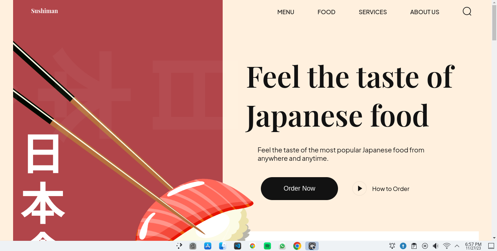
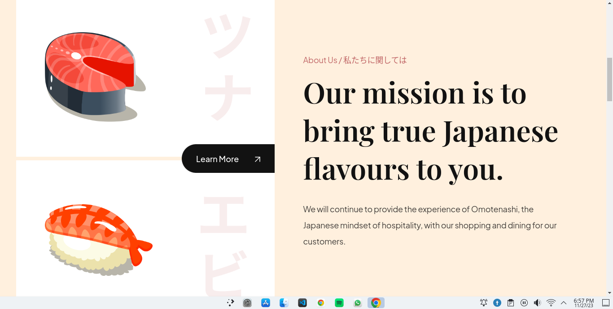
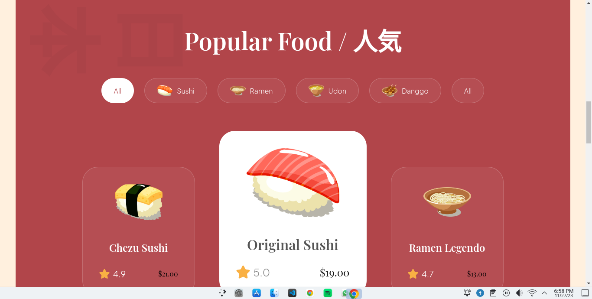
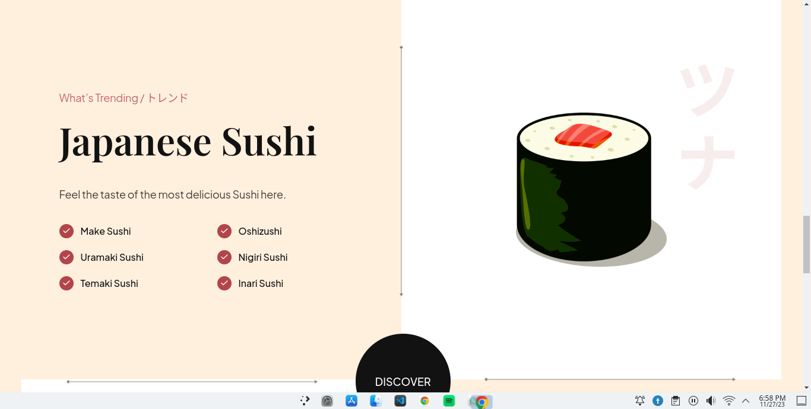
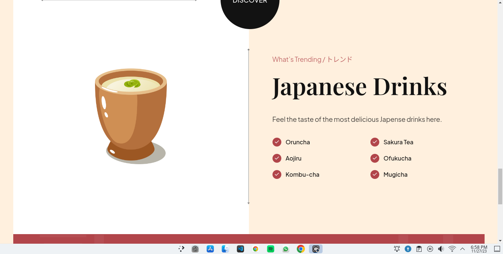
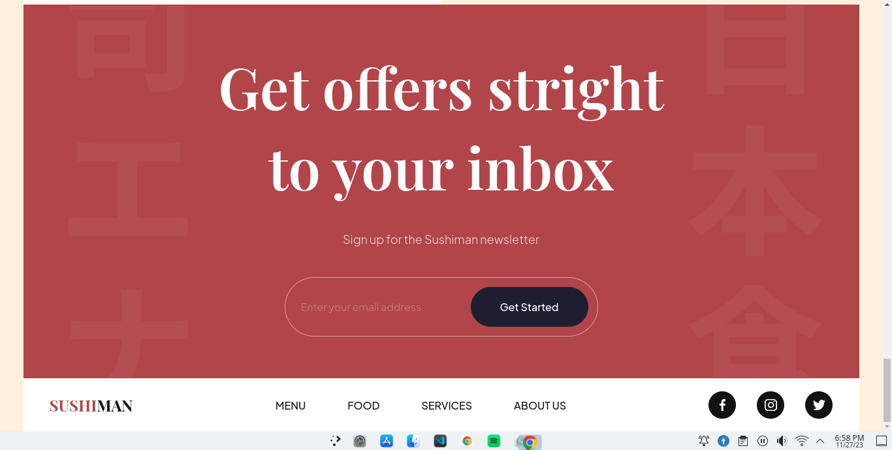

# Sushi

Welcome to the Sushi Delight Website repository! This project is a simple frontend implementation of a sushi website using HTML5 and CSS3. It features a clean and visually appealing design to showcase various sushi offerings.

 <nav>
        <h2>Table of Contents</h2>
        <ul>
            <li><a href="#screenshots">Screenshots</a></li>
            <li><a href="#features">Features</a></li>
            <li><a href="#getting-started">Getting Started</a></li>
            <li><a href="#project-structure">Project Structure</a></li>
            <li><a href="#contributing">Contributing</a></li>
        </ul>
    </nav>
     <section id="screenshots">
        <h2>Screenshots</h2>
        
Here are some screenshots of the Sushi Delight Website:

        
        
        
        
        
        
    </section>
    <section id="features">
        <h2>Features</h2>
        <ul>
            <li><strong>Responsive Design:</strong> The website is designed to be responsive, ensuring a seamless experience across various devices and screen sizes.</li>
            <li><strong>Sushi Showcase:</strong> Browse through a variety of sushi offerings with visually appealing images and detailed descriptions.</li>
            <li><strong>Contact Form:</strong> Interested customers can reach out through the contact form for inquiries or feedback.</li>
        </ul>
    </section>
    <section id="getting-started">
        <h2>Getting Started</h2>
        <ol>
            <li><strong>Clone the Repository:</strong> <code>git clone https://github.com/S11UB11AYAN/Sushi.git</code></li>
            <li><strong>Open the Project:</strong> <code>cd Sushi</code></li>
            <li><strong>Open <code>index.html</code> in a Browser:</strong> Open the <code>index.html</code> file in your preferred web browser to view the website.</li>
        </ol>
        
That's it! You should now see the Sushi Delight website locally on your machine.

    </section>
    <section id="project-structure">
        <h2>Project Structure</h2>
        
The project structure is quite simple and organized:

        <ul>
            <li><strong>index.html:</strong> The main HTML file that structures the content of the website.</li>
            <li><strong>css/:</strong> This directory contains the CSS files.
                <ul>
                    <li><strong>style.css:</strong> The main stylesheet for the website.</li>
                </ul>
            </li>
            <li><strong>assets/:</strong> Store your images here, and reference them in the HTML and CSS files.</li>
        </ul>
        
Feel free to explore and customize the code to suit your needs.

    </section>
    <section id="contributing">
        <h2>Contributing</h2>
        
Contributions are welcome! If you have any improvements or new features to suggest, please open an issue or submit a pull request. For major changes, please discuss them first by opening an issue.

    </section>
    <footer>
     
Thank you for checking out the Sushi Delight Website project! We hope you enjoy exploring the world of sushi through this simple and elegant website. If you have any questions or feedback, feel free to reach out. Happy coding! 🍣✨

    </footer>
      
       

    

